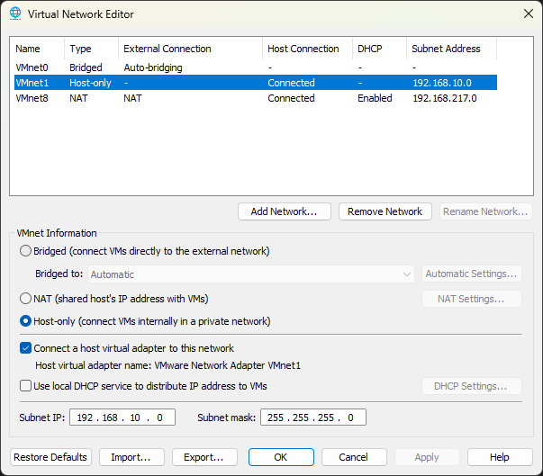
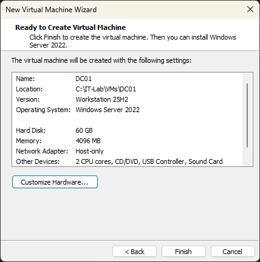

# Lab 00 – Lab Environment Setup

---

## 1. Purpose

This lab establishes the foundational infrastructure for the Enterprise IT Lab.

The objective is to deploy an isolated Windows Server environment that will support future services such as Active Directory, DNS, and DHCP.

The environment is intentionally isolated from the host network to simulate an internal enterprise LAN and provide a controlled environment for testing.

---

## 2. Objectives

- Configure VMware Workstation Pro  
- Create an isolated host-only network  
- Deploy Windows Server 2022  
- Configure static IPv4 addressing  
- Validate internal connectivity  
- Confirm external network isolation  

---

## 3. Environment

### Host System

| Component | Specification |
|---|---|
| CPU | Ryzen 7 9800X3D |
| RAM | 32 GB |
| Storage | NVMe SSD |
| Hypervisor | VMware Workstation Pro |

---

### Virtual Machine

| Machine | OS | Role | IP |
|---|---|---|---|
| DC01 | Windows Server 2022 | Infrastructure Server | 192.168.10.10 |

---

### Network Configuration

| Setting | Value |
|---|---|
| Network Type | Host-only |
| Network | VMnet1 |
| Subnet | 192.168.10.0/24 |
| Default Gateway | None |

A host-only network is used to ensure full isolation while allowing internal communication between lab systems.

---

## 4. Architecture

```
Host Machine
│
VMware Workstation Pro
│
VMnet1 (192.168.10.0 / 24)
│
└─ DC01
   Windows Server 2022
   192.168.10.10
```
---

## 5. Implementation

### 5.1 Network Setup

A host-only network (VMnet1) was configured in VMware Workstation.



---

### 5.2 Virtual Machine Deployment

The DC01 virtual machine was provisioned with the following configuration:

| Setting | Value |
|---|---|
| CPU | 2 vCPU |
| RAM | 4 GB |
| Disk | 60 GB |
| Network | Host-only |



---

### 5.3 Operating System Installation

Windows Server 2022 (Desktop Experience) was installed.

Post-installation:
- Administrator account configured  
- Initial login completed  
- VMware Tools installed  

---

### 5.4 Initial Network State

Before configuration, the server received an APIPA address:

```
169.254.x.x
```
Confirms that no DHCP server is present.


---

### 5.5 Static IP Configuration

A static IPv4 address was assigned:

| Setting | Value |
|---|---|
| IP Address | 192.168.10.10 |
| Subnet Mask | 255.255.255.0 |
| Gateway | None |
| DNS | 192.168.10.10 |

Verification:

```
ipconfig
```


---

## 6. Validation

### 6.1 Internal Connectivity

```
ping 192.168.10.10
```
Result: Successful


---

### 6.2 External Isolation
```
ping 8.8.8.8
```
Result: Request timed out


---

## 7. Key Decisions

- Host-only network used to enforce isolation  
- No default gateway configured to prevent external access  
- Static IP required for future infrastructure roles  

---

## 8. Key Concepts

- Static vs dynamic IP addressing  
- APIPA behavior  
- Network isolation  
- Basic connectivity testing  

---

## 9. Outcome

The environment is stable, isolated, and ready for deployment of directory services.

A fully functional, isolated Windows Server environment is deployed and validated.

This environment serves as the foundation for all subsequent infrastructure labs.

---

## 10. Next Step

Deployment of Active Directory Domain Services (AD DS) and domain controller promotion.

## 11. What I Learned

- A server without DHCP falls back to APIPA (169.254.x.x)  
- Static IP is required for infrastructure roles like domain controllers  
- Without a gateway, external connectivity is not possible  
- Network isolation is critical when testing infrastructure services  